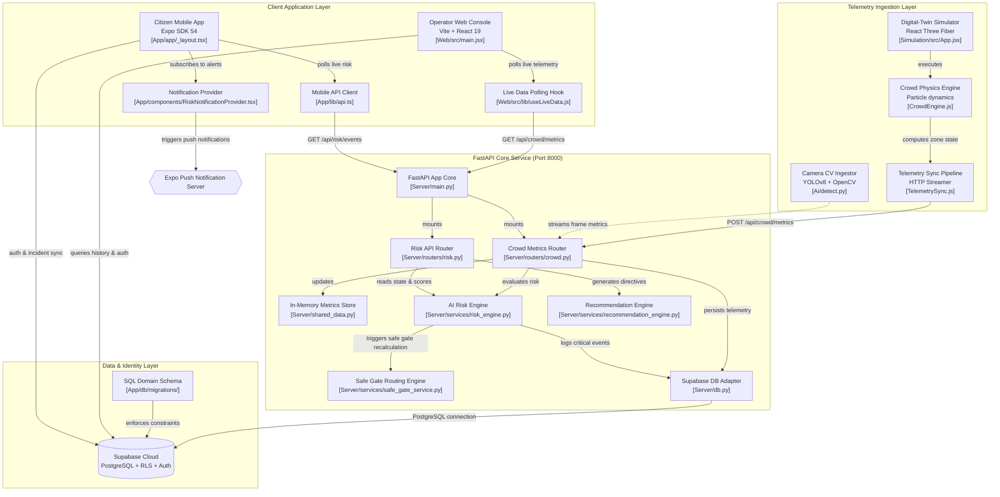

# CrowdShield — AI-Powered Real-Time Crowd Safety & Early-Warning Platform

[](https://fastapi.tiangolo.com/)
[](https://react.dev/)
[](https://expo.dev/)
[](https://supabase.com/)
[](https://tailwindcss.com/)
[](https://python.org/)
[](https://docker.com/)
[](./LICENSE)

> **Transforming reactive crowd control into predictive public safety.**  
> An enterprise-grade, AI-driven early warning and decision support system that ingests live telemetry, evaluates multi-factor risk scores in real-time, calculates dynamic safe evacuations, and broadcasts instant emergency directives to venue operators and citizens.

---

## 📋 Table of Contents

- [📌 Overview](#-overview)
- [🎯 Key Features](#-key-features)
- [🏗️ System Architecture](#️-system-architecture)
- [🔄 Data Flow](#-data-flow)
- [🧱 Tech Stack](#-tech-stack)
- [📁 Repository Structure](#-repository-structure)
- [🧠 AI Risk & Recommendation Engine](#-ai-risk--recommendation-engine)
- [⚙️ API Specification](#️-api-specification)
- [🗄️ Database & Security (Supabase)](#️-database--security-supabase)
- [🚀 Quick Start Guide](#-quick-start-guide)
  - [Prerequisites](#0-prerequisites)
  - [Option A: Docker Compose (Recommended)](#option-a-docker-compose-recommended)
  - [Option B: Manual Service-by-Service Setup](#option-b-manual-service-by-service-setup)
- [🔐 Environment Configuration](#-environment-configuration)
- [🎬 Interactive Demo Flow](#-interactive-demo-flow)
- [🔧 Troubleshooting & FAQs](#-troubleshooting--faqs)
- [🛣️ Production Roadmap](#️-production-roadmap)
- [👥 Team Members](#-team-members)
- [📄 License](#-license)

---

## 📌 Overview

Mass gathering events (stadiums, festivals, transit hubs, pilgrimages) often suffer from sudden crowd surges, severe bottlenecks, and dangerous flow conflicts that can lead to stampedes. Traditional CCTV systems are reactive — operators notice hazards after congestion reaches a crisis point.

**CrowdShield** bridges this gap by introducing a **predictive telemetry pipeline**:
1. **Ingest**: Ingests real-time crowd metrics (density, movement velocity, surge flags, bottleneck markers, flow conflicts) from 3D digital-twin simulators or computer vision camera feeds.
2. **Evaluate**: Computes a dynamic **0–100 Risk Score** categorized into 4 operational threat levels (**SAFE** → **WARNING** → **HIGH** → **CRITICAL**).
3. **Route**: Calculates real-time **Safe Exit Gate Rerouting** based on dynamic gate load and proximity vectors.
4. **Alert**: Surfaces automated operational Standard Operating Procedures (SOPs) on an **Admin Dashboard** and pushes instant push alerts and safe routes to a **Citizen Mobile App**.

---

## 🎯 Key Features

### 🎮 3D Digital-Twin Crowd Simulation (`Simulation/`)
- Built with **React Three Fiber**, **Three.js**, and **React 18**.
- Simulates multi-zone venue crowd dynamics with real-time particle agent movement.
- Configurable crowd generation, speed vectors, bottleneck triggers, and surge controls.
- **Telemetry Sync**: Streams per-zone JSON metrics to the backend API every second with automatic retry & 15-second backoff.

### 🧠 AI Risk Engine & Dynamic Safe-Gate Routing (`Server/`)
- **FastAPI-powered** real-time scoring pipeline.
- Multi-factor weighted decision engine checking density thresholds, velocity spikes, structural bottlenecks, and opposing flow conflicts.
- **Dynamic Gate Rerouting Engine**: Evaluates capacity across venue exit points and calculates optimal redirection paths for panicked crowds.
- Level-gated SOP directive generator for emergency response teams.

### 🖥️ Admin Operator Console (`Web/`)
- Built with **React 19**, **Vite 8**, **Tailwind CSS v4**, **Zustand**, and **Lucide Icons**.
- Interactive 3D/2D venue map visualization with color-coded risk heatmaps.
- Live zone telemetry cards (people count, density, average speed, flow vectors).
- Live simulated CCTV video feed mockup with real-time risk overlays.
- Real-time emergency alert panel with quick-action dispatch buttons.

### 📱 Citizen Mobile App (`App/`)
- Cross-platform mobile client built with **React Native**, **Expo SDK 54**, **Expo Router**, and **NativeWind**.
- Real-time venue danger alerts powered by **Expo Notifications**.
- Live risk level indicator and turn-by-turn safe evacuation routing.
- Citizen incident reporting interface (crowd surge, medical emergency, blocked gate).

### 📹 Computer Vision Pipeline (`Ai/`)
- **YOLOv8 + OpenCV** object detection and tracking prototype (`detect.py`, `tracker.py`, `heatmap.py`).
- Generates crowd count, spatial heatmaps, and velocity vectors directly from raw video feeds.

---

## 🏗️ System Architecture



---

## 🔄 Data Flow

```text
+------------------------+
| 3D Simulation / Camera |  (Tick every 1 second)
+------------------------+
            |
            v
     [POST /api/crowd/metrics]  (Telemetry payload: density, speed, surge, bottleneck, flow_conflict)
            |
            v
+------------------------+
|   FastAPI Service      |  --> In-memory Cache (shared_data.py)
+------------------------+  --> Persistence to Supabase (crowd_data table)
            |
            v
+------------------------+
|     AI Risk Engine     |  --> Computes Multi-Factor Score (0–100)
+------------------------+  --> Assigns Level: SAFE | WARNING | HIGH | CRITICAL
            |
            +-----------------------------------+
            |                                   |
            v                                   v
+------------------------+         +------------------------+
|  Safe-Gate Calculator  |         | Recommendation Engine  |
+------------------------+         +------------------------+
 (Finds nearest low-risk            (Outputs level-gated SOP
  exit gate & route)                 operator directives)
            |                                   |
            +-----------------+-----------------+
                              |
                              v
                   +------------------------+
                   |  Clients (Web & Mobile)|
                   +------------------------+
                    • Admin Web Dashboard updates (cards, map, alerts)
                    • Citizen Mobile App triggers Push Alert & Route
```

---

## 🧱 Tech Stack

| Component | Technology | Version | Purpose |
| --- | --- | --- | --- |
| **Backend API** | Python / FastAPI | `0.141.1` | High-performance async API backend |
| **ASGI Server** | Uvicorn | `0.43.0` | Production ASGI web server |
| **Database & Auth** | Supabase | Postgres + RLS | Cloud database, authentication, & Row Level Security |
| **Admin Dashboard** | React | `19.2.8` | Modern web frontend |
| **Web Build Tool** | Vite | `8.2.1` | Next-gen web bundler |
| **Web Styling** | Tailwind CSS | `4.3.3` | Utility-first styling engine |
| **State Management** | Zustand | `5.0.14` | Fast, lightweight client state management |
| **3D Rendering** | React Three Fiber / Three.js | `0.185.1` | Interactive 3D map rendering & particle simulation |
| **Mobile App** | React Native / Expo | SDK `54.0.37` | Cross-platform citizen mobile app |
| **Mobile Router** | Expo Router | `6.0.24` | File-based navigation for React Native |
| **Mobile Styling** | NativeWind | `4.2.6` | Tailwind CSS for React Native |
| **Push Notifications** | Expo Notifications | `0.32.17` | Native push notification delivery |
| **Computer Vision** | YOLOv8 + OpenCV | Python 3.10+ | Real-time video detection and tracking |
| **Containerization** | Docker / Docker Compose | v2+ | Unified multi-container development environment |

---

## 📁 Repository Structure

```text
CrowdShield/
├── Ai/                         # Computer Vision & Video Ingestion Prototype
│   ├── detect.py               # YOLOv8 object detection & crowd density engine
│   ├── tracker.py              # DeepSORT / ByteTrack particle tracking
│   ├── heatmap.py              # Density spatial heatmap generator
│   └── requirements.txt        # OpenCV, Ultralytics, PyTorch dependencies
│
├── App/                        # Citizen Mobile App (Expo SDK 54)
│   ├── app/                    # Expo Router file-based app routes
│   │   ├── (tabs)/             # Main tab views (Home, Safe Routes, Report, Profile)
│   │   └── _layout.tsx         # Root layout & context providers
│   ├── components/             # Reusable UI components & Notification Provider
│   ├── db/migrations/          # SQL migrations (0001_db_init.sql, 0002_backend_persistence.sql)
│   ├── lib/                    # Supabase client & backend API client
│   └── package.json            # Expo & React Native dependencies
│
├── Server/                     # FastAPI Backend Core
│   ├── main.py                 # FastAPI application entrypoint & CORS middleware
│   ├── db.py                   # Supabase database adapter & async persistence
│   ├── models.py               # Pydantic data schemas & request validation
│   ├── shared_data.py          # In-memory fast cache for live zone metrics
│   ├── routers/                # API route modules
│   │   ├── crowd.py            # Telemetry ingestion & history query endpoints
│   │   └── risk.py             # Risk evaluation & recommendations endpoints
│   ├── services/               # Core business logic
│   │   ├── risk_engine.py      # Multi-factor 0-100 risk scoring engine
│   │   ├── safe_gate_service.py# Dynamic safe exit gate rerouting algorithm
│   │   └── recommendation_engine.py # Level-gated operational SOP generator
│   ├── Dockerfile              # Container spec for FastAPI backend
│   └── requirements.txt        # Python backend dependencies
│
├── Simulation/                 # 3D Digital-Twin Crowd Simulator
│   ├── src/
│   │   ├── App.jsx             # Main simulation UI & stream controls
│   │   └── engine/             # Physics engine & telemetry synchronization
│   │       ├── CrowdEngine.js  # 3D agent movement & zone density physics
│   │       └── TelemetrySync.js# HTTP streaming producer with 15s backoff
│   ├── Dockerfile              # Container spec for 3D simulator
│   └── package.json            # React 18 + R3F dependencies
│
├── Web/                        # Operator Admin Dashboard
│   ├── src/
│   │   ├── main.jsx            # Vite entrypoint
│   │   ├── features/admin/     # Admin console pages (Overview, Map, Alerts, Analytics)
│   │   ├── Map/                # 3D venue map visualizer & zone layers
│   │   ├── lib/                # Live polling hooks & API client
│   │   └── store/              # Zustand global state store
│   ├── Dockerfile              # Container spec for Web Admin Dashboard
│   └── package.json            # React 19 + Tailwind v4 dependencies
│
├── docker-compose.yml          # Dev-mode multi-container orchestrator
├── README.md                   # System documentation
└── LICENSE                     # MIT License
```

---

## 🧠 AI Risk & Recommendation Engine

The Risk Engine (`Server/services/risk_engine.py`) continuously evaluates incoming zone metrics against weighted risk signals:

### 1. Signal Weights & Triggers

| Signal | Score Weight | Threshold Criteria | Explanation |
| --- | ---: | --- | --- |
| **Critical Crowd Density** | **+50** | `density >= 0.00005` | Dangerous crowd compression (people per sq unit) |
| **High Crowd Density** | **+35** | `0.00003 <= density < 0.00005` | Heavy congestion approaching unsafe levels |
| **Moderate Crowd Density** | **+20** | `0.000015 <= density < 0.00003` | Noticeable crowd buildup in zone |
| **Very High Velocity** | **+20** | `average_speed >= 2.5` | Running / chaotic crowd movement spike |
| **High Velocity** | **+10** | `1.5 <= average_speed < 2.5` | Rapid walking / accelerating movement |
| **Crowd Surge** | **+15** | `surge_detected == True` | Sudden directional acceleration in crowd mass |
| **Bottleneck** | **+15** | `bottleneck == True` | Physical constriction at gate/chokepoint |

---

### 2. Threat Level Classification & Operational Directives

Based on the accumulated score, the system categorizes threat levels and issues immediate automated SOP directives (`Server/services/recommendation_engine.py`):

```
 0 - 25   🟢 SAFE       --> Normal monitoring; no operational intervention required.
26 - 45   🟡 WARNING    --> Increase CCTV monitoring; notify nearby security personnel.
46 - 65   🟠 HIGH       --> Deploy security team; control entry gates; broadcast voice advisory.
66 - 100  🔴 CRITICAL   --> Emergency lockdown; Close Gate G3; Open Exit E2; Reroute crowd to dynamic safe exit.
```

---

### 3. Dynamic Safe Exit Gate Routing

When risk reaches **HIGH** or **CRITICAL** at a specific gate (e.g., Gate G3), `Server/services/safe_gate_service.py` evaluates alternative venue gates:

```json
{
  "recommendations": [
    "Close Gate G3",
    "Open Exit E2",
    "Redirect Crowd",
    "Call Emergency Team"
  ],
  "safe_gate": "GATE_E2",
  "risk_score": 12,
  "risk_level": "SAFE",
  "distance": 45.2,
  "direction": "EAST",
  "message": "Redirect crowd to GATE_E2. Move EAST."
}
```

---

## ⚙️ API Specification

FastAPI application running on **`http://localhost:8000`**.  
Interactive Swagger API documentation is available at **`http://localhost:8000/docs`**.

| HTTP Method | Endpoint | Description | Query / Request Body |
| --- | --- | --- | --- |
| `GET` | `/` | Root health message | None |
| `GET` | `/status` | Service operational health status | None |
| `GET` | `/api/crowd/metrics` | Fetch latest in-memory telemetry for all zones | None |
| `GET` | `/api/crowd/history` | Query historical telemetry from Supabase | `limit=50`, `zone_id=` |
| `POST` | `/api/crowd/metrics` | Ingest real-time crowd metrics (persists to DB) | `Metrics` JSON |
| `GET` | `/api/risk/events` | Retrieve recent critical risk events | `limit=50` |
| `POST` | `/api/risk/calculate` | Compute risk score & evaluate level for metrics payload | `Metrics` JSON |
| `POST` | `/api/recommendations` | Compute risk score + safe exit gate rerouting | `Metrics` JSON |

### Sample `Metrics` Telemetry Payload (`POST /api/crowd/metrics`)

```json
{
  "camera_id": "SIM_ZONE_A",
  "zone_id": "ZONE_A",
  "people_count": 84,
  "density": 0.000045,
  "speed": 1.8,
  "surge_detected": true,
  "bottleneck": false,
  "flow_conflict": false,
  "direction": "NORTH",
  "timestamp": "2026-08-21T19:35:00.000Z"
}
```

> **Note**: `POST /api/crowd/metrics` accepts `speed` (as an alias) and maps it internally to `average_speed` via Pydantic (`validation_alias="speed"`).

---

## 🗄️ Database & Security (Supabase)

CrowdShield utilizes **Supabase (PostgreSQL)** for persistence, role-based user management, and Row Level Security (RLS).

### Database Migrations

Apply the migration scripts located in [`App/db/migrations/`](file:///c:/Users/HIMANSHU/Desktop/CLG%20PRJ/CrowdShield/App/db/migrations/) in order within your **Supabase SQL Editor**:

1. **`0001_db_init.sql`**: Core table schemas, triggers, indexes, user profiles, and security policies.
2. **`0002_backend_persistence.sql`**: Adds extended telemetry columns (`surge_detected`, `bottleneck`) and configures `anon` role INSERT permissions for backend persistence.

### Core Tables

- `profiles` — User identity profiles linked to `auth.users` with roles (`citizen`, `authority`, `admin`).
- `venues` — Venue structural configuration, zone boundaries, and gate capacity definitions.
- `crowd_data` — High-frequency time-series telemetry records (zone density, count, speed, flags).
- `risk_events` — Historical log of computed risk score spikes and level transitions.
- `incidents` — Citizen-reported incidents (crowd congestion, medical issue, hazard).
- `alerts` — Operational safety alerts dispatched to admin dashboard and mobile push clients.

---

## 🚀 Quick Start Guide

### 0. Prerequisites

Ensure the following tools are installed on your workstation:
- **Node.js**: v18.0 or higher ([Download Node](https://nodejs.org/))
- **Python**: v3.10 or higher ([Download Python](https://python.org/))
- **Git**: ([Download Git](https://git-scm.com/))
- **Docker Desktop** (Optional, for containerized runner): ([Download Docker](https://www.docker.com/))

---

### Option A: Docker Compose (Recommended)

Run the backend server, admin web dashboard, and 3D simulator with a single command:

```bash
# 1. Clone repository
git clone https://github.com/HimanshuKumarRout/crowdshield.git
git clone https://github.com/chandrakantamandal/crowdshield.git
git clone https://github.com/kalakanhuswain18-hub/crowdshield.git
cd crowdshield

# 2. Start all services in dev-mode
docker compose up --build
```

Access the running applications:
- ⚡ **Backend API**: `http://localhost:8000` (Swagger docs: `http://localhost:8000/docs`)
- 🖥️ **Admin Dashboard**: `http://localhost:5173`
- 🎮 **3D Simulation**: `http://localhost:3000`

To stop all containers:
```bash
docker compose down
```

---

### Option B: Manual Service-by-Service Setup

#### 1. Backend Server (`Server/`)

```bash
cd Server

# Create Python virtual environment
python -m venv .venv
# Activate on Windows:
.venv\Scripts\activate
# Activate on Linux/macOS:
source .venv/bin/activate

# Install dependencies
pip install -r requirements.txt

# Create .env file from environment configuration section
# Start FastAPI backend with hot-reloading
uvicorn main:app --reload --port 8000
```

#### 2. Admin Dashboard (`Web/`)

```bash
cd Web

# Install Node dependencies
npm install

# Start Vite development server
npm run dev
```

Dashboard will launch at `http://localhost:5173`.

#### 3. 3D Digital-Twin Simulation (`Simulation/`)

```bash
cd Simulation

# Install Node dependencies
npm install

# Start Vite development server
npm run dev
```

Simulation will launch at `http://localhost:3000`.

> **Important**: In the simulation UI, click **Toggle Telemetry Sync: ON** to start streaming zone metrics to the backend API (`http://localhost:8000/api/crowd/metrics`).

#### 4. Citizen Mobile App (`App/`)

```bash
cd App

# Install Node dependencies
npm install

# Start Expo development server
npx expo start
```

Scan the displayed QR code using the **Expo Go** app on your iOS or Android device.

---

## 🔐 Environment Configuration

Create `.env` files in their respective service directories:

### `Server/.env`
```env
SUPABASE_URL=https://your-supabase-project.supabase.co
SUPABASE_ANON_KEY=your-supabase-anon-key
```

### `Web/.env`
```env
VITE_SUPABASE_URL=https://your-supabase-project.supabase.co
VITE_SUPABASE_ANON_KEY=your-supabase-anon-key
VITE_API_URL=http://localhost:8000
```

### `App/.env`
```env
EXPO_PUBLIC_API_URL=http://<YOUR-LOCAL-IP-ADDRESS>:8000
EXPO_PUBLIC_SUPABASE_URL=https://your-supabase-project.supabase.co
EXPO_PUBLIC_SUPABASE_ANON_KEY=your-supabase-anon-key
```

> 💡 **Tip**: When testing the mobile app on a physical device, replace `localhost` in `EXPO_PUBLIC_API_URL` with your computer's local Wi-Fi IP address (e.g., `http://192.168.1.50:8000`).

---

## 🎬 Interactive Demo Flow

Follow these steps to demonstrate the end-to-end capabilities of CrowdShield:

```text
Step 1: Launch Backend Server
        Run `uvicorn main:app --reload --port 8000` inside `Server/`.
        Verify health at `http://localhost:8000/status`.

Step 2: Launch 3D Simulation
        Run `npm run dev` inside `Simulation/` and open `http://localhost:3000`.
        Click "Toggle Telemetry Sync" to start streaming metrics for 5 zones (ZONE_A...ZONE_E).

Step 3: Launch Admin Dashboard
        Run `npm run dev` inside `Web/` and open `http://localhost:5173`.
        Observe live zone telemetry cards updating every 2 seconds.

Step 4: Trigger Artificial Crowd Surge
        In the 3D Simulation UI:
        - Spurt crowd count in ZONE_C up to 150 agents.
        - Enable "Trigger Bottleneck" or "Trigger Surge".

Step 5: Observe Automated Escalation
        - Backend Risk Engine score jumps from 15 (SAFE) to 85 (CRITICAL).
        - Web Dashboard highlights ZONE_C in RED with emergency alerts.
        - Recommendation panel issues directive: "Close Gate G3, Open Exit E2, Redirect Crowd".

Step 6: Citizen Mobile Evacuation
        - Mobile App receives push alert notification.
        - App displays safe rerouting guidance directing users toward GATE_E2.
```

---

## 🔧 Troubleshooting & FAQs

<details>
<summary><b>1. The Backend fails to start or shows Supabase connection error</b></summary>

> The backend includes a graceful fallback. If `SUPABASE_URL` or `SUPABASE_ANON_KEY` are missing or invalid, the API still boots and performs real-time in-memory risk scoring; only durable database persistence will be bypassed.
</details>

<details>
<summary><b>2. Simulation telemetry is not showing up on the Web Dashboard</b></summary>

> 1. Verify the simulator's **Telemetry Sync** toggle is set to `ON`.
> 2. Ensure `Server` is running on port 8000. If running on a non-default port, update `VITE_API_URL` in `Web/.env` and `Simulation/src/engine/TelemetrySync.js`.
</details>

<details>
<summary><b>3. Mobile App cannot connect to the backend server</b></summary>

> Mobile physical devices cannot access `localhost`. Ensure `EXPO_PUBLIC_API_URL` in `App/.env` uses your machine's LAN IP address (e.g. `http://192.168.x.x:8000`) and both device and host are connected to the same Wi-Fi network.
</details>

---

## 🛣️ Production Roadmap

- [x] **Phase 1: Real-Time Telemetry & Core Scoring Pipeline** (Completed)
  - 3D simulator telemetry ingestion, multi-factor risk engine, basic SOP recommendations.
- [x] **Phase 2: Client Dashboards & Mobile Alerting** (Completed)
  - Operator React 19 console, Expo citizen mobile app, Supabase persistence.
- [x] **Phase 3: Event-Driven Stream Architecture**
  - Replace polling with WebSockets / Server-Sent Events (SSE).
  - Integrate Apache Kafka / Redis Streams for high-throughput chokepoints.
- [x] **Phase 4: Multi-Camera Computer Vision Ingestion**
  - Deploy YOLOv8 edge compute nodes directly on venue RTSP CCTV streams.
- [x] **Phase 5: Predictive AI Density Forecasting**
  - Train LSTM / Graph Neural Networks on historical `crowd_data` to forecast crowd congestion 15 minutes before bottlenecks occur.

---

## 👥 Team Members

- Himanshu Kumar Rout
- Chandrakanta Mandal
- Kalakanhu Swain

---

## 📄 License

This project is licensed under the **MIT License**.  
See the [`LICENSE`](./LICENSE) file for full details.

---

<div align="center">

**CrowdShield** • Built for Hackathon Innovation & Public Safety  
*Simulate → Analyze → Alert → Act.*

</div>
